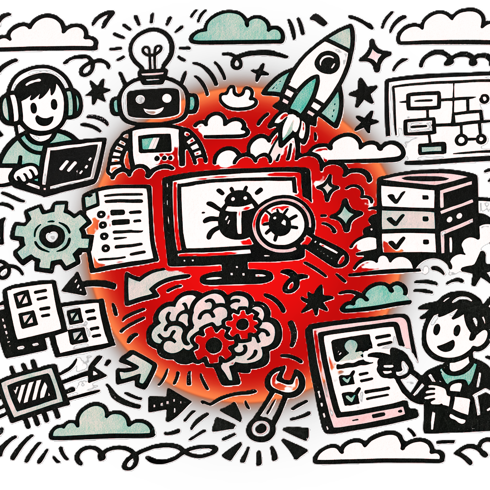

--- 
title: Implementación ética
summary: Implementación ética, segura y operacional de soluciones con IA generativa.
authors:
    - Manuela Iborra
    - Jose Robledano
date: 2026-02-25
---
## El Amanecer de una Nueva Era en la Informática

Nos encontramos ante un momento definitorio en la educación tecnológica. La Inteligencia Artificial generativa no es solo una nueva herramienta; es un cambio de paradigma que está redefiniendo varias familias profesionales. No se trata de competir contra la máquina, sino de enseñar a nuestros futuros profesionales a orquestar estas tecnologías para alcanzar niveles de innovación y eficiencia sin precedentes. 

El objetivo es transformar la curiosidad tecnológica en competencia profesional sólida y responsable.

!!! info "Misión"
    Capacitar a la próxima generación de técnicos y desarrolladores para que sean creadores críticos, no meros consumidores de la inteligencia artificial.

<figure markdown></figure>

## Fundamentos Éticos: La Brújula del Nuevo Talento

En el corazón de la integración de la IA generativa debe residir una ética inquebrantable. Al generar código, diseñar arquitecturas o automatizar redes, nuestros estudiantes deben comprender que la tecnología tiene un impacto real en la sociedad. Debemos infundir en ellos el respeto por la propiedad intelectual, enseñándoles a distinguir entre inspiración algorítmica y plagio. 

Además, es vital abordar los sesgos inherentes en los modelos de IA; un algoritmo entrenado con datos sesgados perpetuará desigualdades. 

Enseñar a auditar y cuestionar los resultados de la IA formará profesionales íntegros que desarrollen soluciones justas, transparentes y centradas en el bienestar humano.

### Del Concepto a la Realidad: Casos Prácticos de Ética en la IA

Para que el alumnado interiorice la ética profesional, debemos abandonar el plano puramente filosófico y aterrizar en los teclados, los servidores y las líneas de código que manejarán a diario. 

A continuación, exploramos cómo abordar los pilares éticos de la IA generativa a través de situaciones cotidianas en los ciclos de Informática y Comunicaciones, ofreciendo herramientas para el **debate crítico** en el aula.

#### Propiedad Intelectual: El Espejismo del Código Abierto

Uno de los mayores riesgos de la IA generativa en la programación es la infracción de licencias.

Los modelos han sido entrenados con millones de repositorios públicos, y en ocasiones, regurgitan fragmentos exactos de código protegido o bajo licencias restrictivas (como GPL) sin atribuir la autoría.

!!! example "Caso de Estudio: El algoritmo de encriptación 'prestado'"
    
    **La Situación:** Un alumno de Desarrollo de Aplicaciones Multiplataforma (DAM) está diseñando una pasarela de pago para su proyecto final. Pide a un asistente de IA (como GitHub Copilot o ChatGPT) que le genere una función para encriptar los datos de las tarjetas. La IA genera un código impecable. El alumno lo integra, asumiendo que es "código nuevo" y libre de derechos.

    **El Conflicto:** El código generado resulta ser idéntico al de una librería propietaria de una empresa de ciberseguridad. En un entorno profesional real, si este código llegara a producción, la empresa del alumno enfrentaría una demanda millonaria por violación de propiedad intelectual.

    **El Enfoque Docente:** Utilizar este caso para enseñar **auditoría de licencias**. El alumnado debe entender que **la IA no exime de la responsabilidad legal**. Deben aprender a buscar el origen de algoritmos complejos, entender las diferencias entre licencias MIT, GPL y propietarias, y documentar siempre qué partes de su software han sido asistidas por IA.

#### Sesgos Algorítmicos: El Filtro Invisible

La IA aprende de datos históricos, y la historia tecnológica y social está llena de sesgos (de género, raza, procedencia, etc.). 

Si el alumnado no aprende a identificar estos sesgos, construirán sistemas que automaticen e invisibilicen la discriminación.

!!! example "Caso de Estudio: El portal de empleo discriminatorio"
        
    **La Situación:** En la asignatura de Desarrollo de Interfaces, una alumna utiliza una API de IA generativa para clasificar automáticamente currículums subidos a una plataforma de empleo simulada, basándose en la "idoneidad" para puestos técnicos.

    **El Conflicto:** Al hacer pruebas, la alumna nota que el sistema otorga sistemáticamente puntuaciones más altas a candidatos hombres o a currículums que usan términos típicamente masculinos ("lideré", "desarrollador"), descartando perfiles igualmente válidos de mujeres ("desarrolladora"). El modelo subyacente replicó el sesgo histórico de la industria tecnológica.

    **El Enfoque Docente:** Este es un momento excelente para hablar sobre la **equidad en el diseño de software**. Enseñar al alumnado a no confiar ciegamente en las cajas negras algorítmicas, a diseñar conjuntos de datos de prueba (datasets) que busquen activamente romper el sesgo del modelo, y a implementar validaciones humanas obligatorias en decisiones críticas.

#### Responsabilidad y Transparencia: La Ilusión de Comprensión

En el mundo de la Administración de Sistemas Informáticos en Red (ASIR), un error no solo rompe una aplicación, sino que puede tumbar toda la infraestructura de una empresa. El uso de IA para generar comandos sin comprenderlos es uno de los mayores peligros operativos y éticos.

!!! example "Caso de Estudio: La caída del servidor fantasma"

    **La Situación:** Un estudiante de ASIR necesita crear un *script* en Bash para purgar archivos temporales antiguos en un servidor Linux. Le pide a la IA que lo escriba por él. La IA devuelve un comando `find` combinado con `rm -rf`. El estudiante lo copia, lo pega y lo ejecuta con permisos de administrador (root).

    **El Conflicto:** El *script* contenía una alucinación técnica sutil en la ruta de ejecución y terminó borrando los directorios de configuración de red del servidor, dejándolo inaccesible y provocando una caída total del servicio. Cuando el profesor le pregunta qué pasó, el estudiante responde: "No lo sé, lo hizo la IA".

    **El Enfoque Docente:** Aquí se aborda el principio ético fundamental de la **responsabilidad técnica (Accountability)**. La IA no tiene la culpa; la tiene el técnico que aprueba la ejecución. Hay que inculcar la regla de oro: *"Nunca ejecutes un código que no seas capaz de explicar línea por línea"*. Fomenten la transparencia enseñándoles a dejar comentarios en el código que indiquen que fue generado por IA y validado por ellos mismos.

#### Integridad Profesional: El Esfuerzo Cognitivo frente al Atajo

La ética del propio estudiante y su desarrollo como profesional. 

La línea entre usar la IA como tutor o usarla para suplantar el esfuerzo intelectual es muy fina.

!!! example "Caso de Estudio: El proyecto de fin de ciclo automatizado"

    **La Situación:** Un estudiante entrega una memoria técnica de 50 páginas y la arquitectura completa de una aplicación web, todo #24 impecablemente redactado y programado. Sin embargo, al pedirle en la defensa oral que modifique una sola vista de la base de datos o que explique un patrón de diseño utilizado, es incapaz de hacerlo.

    **El Conflicto:** El alumno ha externalizado todo su pensamiento crítico a la IA. Ha confundido la finalización de una tarea con la adquisición de una competencia. Profesionalmente, esto se traduce en "el síndrome del impostor algorítmico", donde el técnico no puede mantener, escalar ni depurar el sistema que supuestamente creó.

    **El Enfoque Docente:** Esto nos obliga a replantear cómo evaluamos. La ética aquí se fomenta transformando la evaluación: menos peso a la entrega final y más peso al proceso, la defensa, y la capacidad de modificar en vivo el código generado. Es enseñarles que la integridad profesional significa ser dueño de las propias herramientas, no al revés.

## Seguridad por Diseño: Protegiendo el Entorno Tecnológico

<figure markdown></figure>

La seguridad no puede ser una ocurrencia tardía al utilizar herramientas generativas en la informática. 

Cuando un estudiante utiliza un asistente de programación impulsado por IA, debe ser plenamente consciente de qué datos está compartiendo. Existe el riesgo real de exponer código propietario, credenciales o datos sensibles de usuarios. 

La formación debe enfatizar la "seguridad por diseño": enseñar a anonimizar consultas, validar rigurosamente el código generado en busca de vulnerabilidades (como inyecciones SQL o fallos de autenticación) y comprender las políticas de retención de datos de los modelos que utilizan. 

Un profesional competente es aquel que innova sin comprometer la integridad y confidencialidad del sistema.

## Excelencia Operacional: Elevando la Productividad

La implementación operacional de la IA generativa es donde la teoría se convierte en rendimiento tangible. 

En áreas como el desarrollo de aplicaciones (DAM/DAW) o la administración de sistemas (ASIR), la IA actúa como un multiplicador de fuerzas. Debemos enseñar al alumnado a integrar estas herramientas en sus flujos de trabajo diarios: desde la generación de *scripts* de automatización y la creación rápida de prototipos, hasta la redacción automática de documentación técnica y la depuración de errores complejos. 

El objetivo es que aprendan a delegar las tareas mecánicas a la IA para poder concentrar su esfuerzo cognitivo en el diseño arquitectónico, la resolución de problemas de alto nivel y la estrategia tecnológica.

!!! tip "Buenas prácticas operacionales"
    
    * **Prompt Engineering Técnico:** Formular peticiones precisas para obtener código eficiente.
    * **Validación Estricta:** Nunca desplegar código generado en producción sin revisión humana exhaustiva.
    * **Automatización Asistida:** Usar la IA para generar pruebas unitarias y de integración.

## Integración en los Estándares Profesionales

Adaptar los currículos y los resultados de aprendizaje no significa reescribirlos desde cero, sino actualizarlos con la capa transversal de la IA. 

Las competencias profesionales de la informática y las comunicaciones ahora exigen una "alfabetización en IA". Esto significa evaluar a los estudiantes no solo por su capacidad de escribir código desde una pantalla en blanco, sino por su habilidad para interactuar con modelos de lenguaje, evaluar críticamente las respuestas proporcionadas, corregir las alucinaciones del modelo y ensamblar fragmentos generados en un sistema funcional y cohesivo. 

Los estándares deben evolucionar para medir el criterio técnico, la capacidad de auditoría y la gestión de proyectos asistidos por IA.

## El Docente como Arquitecto del Futuro

Los docentes están experimentando una evolución en su propia profesión. 

El enfoque ya no reside exclusivamente en la transmisión de conocimientos sintácticos —puesto que la IA ya domina la sintaxis de casi cualquier lenguaje de programación—, sino en la mentoría estratégica. Su labor ahora se asemeja a la de un director de orquesta: enseñan a pensar computacionalmente, a estructurar problemas complejos, a depurar lógica avanzada y a mantener el control de calidad. 

Su experiencia, su intuición y su capacidad para fomentar el pensamiento crítico son insustituibles. 

Ninguna IA puede inspirar a un estudiante a superar la frustración de un problema complejo como lo hace un buen profesor.

## Hacia el Siguiente Nivel de la Formación Tecnológica

Abrazar la IA generativa con un enfoque ético, seguro y operativo preparará a nuestro alumnado para liderar el mercado laboral del mañana. 

El miedo a la obsolescencia debe transformarse en el motor de la innovación en nuestras aulas. 

Al integrar estas competencias en la familia profesional de Informática y Comunicaciones, estamos garantizando que nuestros egresados no solo sean técnicamente impecables, sino también profesionales responsables, seguros y altamente productivos. 

El futuro del desarrollo tecnológico se escribe hoy en tu aula.

