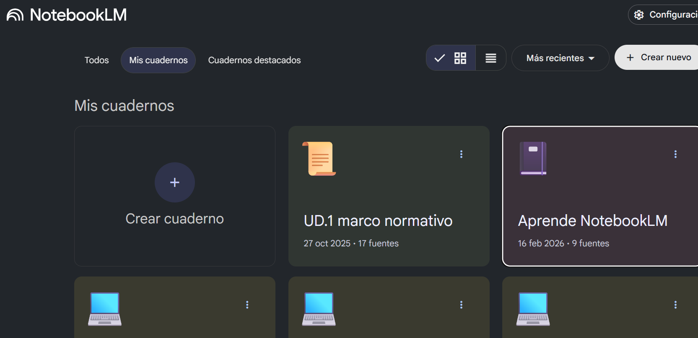

--- 
title: Herramientas IA, aplicadas a estándares profesionales
summary: Los estandares profesionales y herramientas vinculadas con la IA Generativa.
authors:
    - Manuela Iborra
    - Jose Robledano
date: 2026-02-16
---

## Google NotebookLM: De la Comprensión Básica a la Maestría en Productividad

### El Nuevo Paradigma de la Investigación Asistida por IA

NotebookLM no es un "chatbot" convencional ni un simple motor de búsqueda; es un sistema de gestión del conocimiento (CMS) basado en el modelo Gemini de Google. 

En su esencia, las siglas "LM" definen su naturaleza como un Language Model diseñado específicamente para el **análisis de información semántica compleja**. 

En la era de la sobrecarga de información, su importancia estratégica reside en su capacidad para actuar como un **sistema experto cerrado**, donde el usuario define los límites del conocimiento mediante la selección de fuentes.

El diferencial crítico de esta herramienta es el Grounding (anclaje). A diferencia de las IAs generativas generalistas, NotebookLM se ciñe exclusivamente al corpus de información proporcionado, eliminando virtualmente las "alucinaciones". 

!!! alert "Cambian las reglas del juego"

  Pasamos de la generación probabilística de texto a una síntesis basada en evidencia verificable. 
  
  Con la capacidad de procesar hasta 50 fuentes por *notebook*, el sistema no busca el volumen masivo de datos, sino la construcción de un ecosistema controlado y de alta calidad técnica.

<figure markdown></figure>

### Arquitectura del Sistema: El *notebook* como Sistema Experto

Para operar con maestría, debemos concebir el *notebook* no como una carpeta de archivos, sino como un estudio digital compuesto por tres áreas operativas que facilitan el flujo de trabajo RAG (Retrieval Augmented Generation):

* **Fuentes** (Gestión de Material): El repositorio de entrada donde reside el conocimiento crudo.
* **Chat** (Interacción RAG): El motor de consulta donde se interroga al sistema y se obtiene atribución parentética inmediata (Citar la fuente justo después del dato, entre paréntesis).
* **Studio** (Generación de Productos): El panel de salida donde el conocimiento se transforma en materiales estratégicos.

#### Clasificación y Manejo de Fuentes

!!! info "Renombrar fuentes"
  
  Es imperativo aplicar una nomenclatura significativa a los archivos (renombrar códigos numéricos por títulos descriptivos) antes de la carga. Esto optimiza la trazabilidad de las citas y facilita la auditoría del sistema.

Tipo de Entrada	Origen de los Datos	Recomendación Estratégica
PDF / .txt / MD	Documentos locales	Ideal para artículos científicos (Scopus/WoS) e informes técnicos.
Audio (mp3)	Grabaciones / Podcast	Permite procesar webinars o entrevistas sin transcripción previa.
Google Drive	Docs y Slides	Facilita la integración de borradores y cultura organizacional propia.
URLs / YouTube	Sitios y Vídeos	Convierte el contenido audiovisual en una base consultable en segundos.
Texto Copiado	Portapapeles	Para fragmentos específicos de bases de datos o notas rápidas.

En este sistema, la **"Nota"** es la unidad atómica de salida que puede guardarse y, eventualmente, retroalimentar el cuaderno para elevar el nivel de síntesis.

### Nivel Básico: Interacción y Verificación de Datos

El dominio inicial requiere un flujo de trabajo de "Revisar y Ajustar". No basta con la instrucción inicial; el especialista debe auditar la interpretación del sistema para evitar omisiones sutiles.

* Mecánica de Chat y Trazabilidad: Cada respuesta de NotebookLM genera citas numeradas. El clic de trazabilidad es el antídoto definitivo contra la incertidumbre: permite saltar al fragmento exacto del documento original para validar el contexto.
* Flujo de Verificación Rápida: Antes de producir contenido, valide su corpus con estos prompts:
  1. "Genera una tabla de conceptos clave y sus definiciones técnicas según estas fuentes."
  2. "Identifica los 5 ejes argumentales principales y sus posibles contradicciones."
  3. "Extrae las conclusiones explícitas y los hitos mencionados."

### Nivel Intermedio: Síntesis Multimodal y el Panel Studio

La transformación de formato mejora la retención cognitiva y la versatilidad del entregable. El panel Studio permite una metasíntesis de alto impacto.

* Análisis de Informes Articulados: El informe tipo Resumen no es un párrafo breve; es un documento temático que puede superar las 4,000 palabras y 12 páginas, conectando todas las fuentes en un todo unitario. Otros formatos incluyen la Guía de Estudio (con cuestionarios y glosarios) y la Cronología (eventos y elenco de personajes).
* Audio Overview: Un resumen estilo podcast con dos voces que debaten el contenido. Es una herramienta de revisión excepcional para consumir información compleja de forma auditiva.
* Mapa Mental Interactivo: Estructura de nodos donde cada uno actúa como un disparador (trigger) de nuevos prompts, permitiendo una exploración no lineal del conocimiento.
* Visuales e Infografías: El sistema permite generar borradores visuales indicando directrices de estilo (ej. "Estilo minimalista", "Vertical para Stories" o "Cuadrado para Feed"). Se recomienda instruir al sistema para evitar párrafos largos y priorizar la jerarquía visual.
* Deep Research (Investigación Adicional): Función avanzada para completar contextos cuando la fuente principal es insuficiente. Nota estratégica: El uso de fuentes externas diluye la trazabilidad pura del anclaje.

### Nivel Avanzado I: Ingeniería de Prompts para Profesionales

Para el estratega senior, los prompts son conversaciones estructuradas. La calidad del output depende de la definición del rol, la estructura y la audiencia.

Catálogo de Prompts de Alto Valor

1. El Informe de Inversores: "Crea un informe ejecutivo de 2 páginas. Objetivo: Decidir en 2 minutos. Enfoque: Análisis de riesgos, oportunidades y predicciones financieras."
2. La Guía del Mentor: "Genera una guía educativa. Incluye '5 señales de alarma' y pasos accionables. Tono: Cercano y preventivo."
3. El Análisis Técnico: "Desarrolla una comparativa de realidades vs. expectativas. Prioriza la honestidad técnica y destaca limitaciones reales para evitar el hype."
4. El Informe Periodístico: "Construye una pieza investigativa de 2000 palabras. Múltiples perspectivas y lead impactante. No compartas opiniones, comparte evidencia."
5. La Presentación "Para Humanos": "Diseña 10 slides usando analogías simples. Criterio de calidad: Que mi madre lo entienda a la primera."

El Multiplicador: Aplique la Recreación Cultural. En lugar de traducir literalmente, pida al sistema que adapte el informe a un nuevo mercado usando referencias culturales, ejemplos locales y el tono apropiado para esa audiencia específica.

### Nivel Avanzado II: Investigación Académica y Científica

NotebookLM democratiza la síntesis de evidencia científica, permitiendo realizar revisiones de la literatura de tipo Rapid Review con rigor metodológico.

* Metodología SALSA y PRISMA-ScR: Se recomienda seleccionar los 50 artículos más citados de Scopus o WoS sobre un tema. Use NotebookLM para la fase de Análisis y Síntesis, cumpliendo con el framework PRISMA-ScR para examinar áreas de conocimiento poliédricas.
* Marco VERITAS (Interacción Crítica Escalonada): El investigador no delega el pensamiento; interviene cada acción:
  * Verificar la exactitud de cada cita.
  * Evaluar la relevancia del sesgo de la IA.
  * Atribuir con precisión parentética.
  * Editar para aportar pensamiento crítico humano.
* Ética y Deuda Cognitiva: El uso no declarado de IA constituye plagio de ideas, ya que el usuario se apropia de la síntesis de autores originales procesados por la máquina. Un uso deshonesto es "hacer ejercicio viendo a otros hacer ejercicio"; genera un título, pero no conocimiento.

### Estrategias Maestro: Optimizando el Flujo de Trabajo (Hacks Pro)

La maestría se alcanza cuando el sistema se convierte en una extensión sistémica de nuestra propia voz.

* Entrenamiento de Estilo: Cargue un cuaderno exclusivamente con sus textos previos. Instruya a la IA para que emule su sintaxis, tono y voz.
* Integración con Gemini: Use el botón "Adjuntar Notebook" en la interfaz de Gemini para solicitar productos complejos (como landing pages o cursos estructurados) basados exclusivamente en el conocimiento anclado de su cuaderno.
* Bucle de Refinamiento Estratégico: Al "Convertir Notas en Fuentes", tenga precaución. Si bien permite elevar la síntesis, un uso excesivo puede crear un bucle redundante o entrópico que degrade la calidad del corpus original.
* Gestión de Ecosistema: Dado que la interfaz nativa es limitada, utilice extensiones como NotebookLM Tools para organizar cuadernos en carpetas temáticas y gestionar múltiples proyectos simultáneamente.

### Conclusión: De la Consumición Pasiva a la Producción Inteligente

NotebookLM marca el fin de la lectura pasiva. Al eliminar la fricción entre la absorción de datos y la entrega de valor, permite que estudiantes, creadores y profesionales transiten del "ver/leer" al "producir/entregar" en cuestión de minutos.

Sin embargo, esta potencia exige una honestidad intelectual innegociable. La herramienta debe actuar como un potenciador de nuestra capacidad crítica, nunca como su sustituto. En última instancia, NotebookLM no es el destino final de la investigación, sino el motor que nos permite alcanzar una claridad y un rigor profesional hasta ahora inalcanzables. El futuro del conocimiento no pertenece a quien tiene más información, sino a quien sabe transformarla en valor con integridad y maestría.

## Otras opciones: Alternativas

[Surfsense](https://www.surfsense.com/){: target="_blank"}