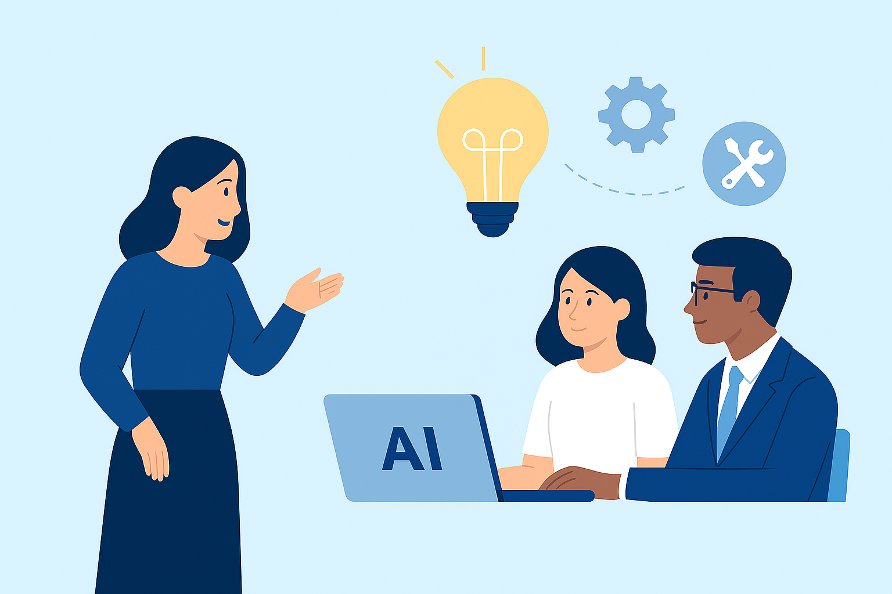
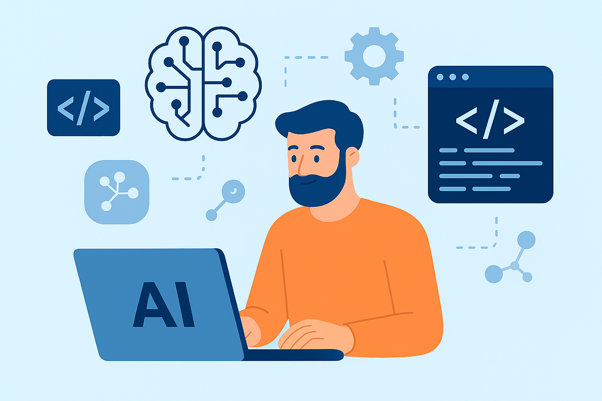

--- 
title: Herramientas IA, aplicadas a estándares profesionales
summary: Los estandares profesionales y herramientas vinculadas con la IA Generativa.
authors:
    - Manuela Iborra
    - Jose Robledano
date: 2026-02-16
---
# La IA como herramienta y asistente profesional

## Formación y cambio cultural: preparar a las personas para trabajar con IA

Además de desarrollar tecnología, la IA ejercerá un papel fundamental en la formación y la capacitación del personal. 

La integración de la IA no es solo un reto técnico, sino también organizativo y cultural.

El impulso de programas de alfabetización en inteligencia artificial adaptados a diferentes perfiles: personal profesionales. 

!!! info "Objetivo"
    
    El objetivo es que las personas no solo aprendan a utilizar herramientas concretas, sino que también sepan identificar oportunidades de uso, evaluar resultados y tomar decisiones informadas.

Esta capacitación será clave para que la IA se integre de una forma natural en la actividad diaria y para evitar usos poco críticos o poco responsables de la tecnología.

En el contexto actual, se está planteando en muchas implementaciones, que la IA funcione con un modelo centralizado, que permita concentrar el conocimiento técnico y establecer las bases del nuevo sistema. 

Será necesario contar con un equipo especializado, con perfiles en ámbitos como la inteligencia artificial, los datos, la seguridad, la ética y la gestión del cambio.

## Creación de materiales didácticos, programaciones y recursos para el aula

<figure markdown></figure>

Esta es, con diferencia, **la demanda más repetida**. Los docentes buscan herramientas que les ayuden a generar apuntes, programaciones didácticas, ejercicios, rúbricas y presentaciones de forma eficiente y de calidad.

- **IGNITE Copilot**: Es la herramienta más completa para el profesorado en español. Está específicamente diseñada para el currículo español (LOMLOE) y de LATAM, y tiene una cobertura total de la Formación Profesional. Genera programaciones didácticas completas, situaciones de aprendizaje, unidades didácticas y rúbricas de evaluación automáticas alineadas con los resultados de aprendizaje. Además, integra el Diseño Universal para el Aprendizaje (DUA) .

Responde a: "crear apunts de classe, programacions didàctiques, PCCFs", "preparar materiales, recursos y ejercicios", "crear actividades que ajudin l’alumnat a entendre millor la tecnologia".

- **eduki (herramientas IA)**: Esta plataforma de intercambio de materiales ha integrado IA para ayudar a los docentes a personalizar recursos. Entre sus herramientas destacan un planificador de clases, un generador de rúbricas de evaluación y un adaptador de textos por niveles, permitiendo adaptar un mismo texto para diferentes capacidades lectoras .

Responde a: "personalizar recursos de aula de forma instantánea", "adaptar todos los materiales a l'ensenyament a distància", "generación de prácticas, simulaciones y casos reales adaptados al nivel del alumnado".

- **Google Gemini**: Su integración nativa con el ecosistema de Google (Docs, Slides, Forms) lo convierte en una herramienta muy potente para el día aía. Puede generar textos directamente en un documento, crear presentaciones en Slides o formular preguntas para un formulario, todo con instrucciones sencillas. Su nivel gratuito es muy completo .

Responde a: "mejorar en el uso y adaptación de la IA como docente", "utilizar la IA en el día a día de nuestro trabajo".

- **Gamma**: Aunque no aparece en los resultados de búsqueda, es una herramienta de referencia en 2026 para crear presentaciones, documentos y páginas web con un aspecto muy visual a partir de simples prompts. Es ideal para generar materiales atractivos rápidamente.

### Copilot y opciones didácticas

<figure markdown></figure>

#### New chat (Nuevo chat)

Permite iniciar una nueva conversación con Copilot sin mantener el contexto previo. Esta función está disponible siempre que el usuario tenga **elegibilidad para Copilot Chat**, ya que forma parte de la experiencia principal del asistente en Microsoft 365.  
Fuente: descripción general de Copilot Chat. [1](https://learn.microsoft.com/es-es/copilot/microsoft-copilot)

---

#### Búsqueda

Permite buscar dentro del contenido disponible en Copilot, especialmente dentro de la **Biblioteca**, cuando esta función está habilitada. La búsqueda permite filtrar imágenes, páginas y otros elementos generados o compartidos contigo.  
Fuente: funciones de búsqueda dentro de la Biblioteca de Copilot. [2](https://learn.microsoft.com/es-es/copilot/microsoft-365/copilot-library)

---

#### Biblioteca (Copilot Library)

Es el centro donde se almacena de manera automática el contenido generado mediante Copilot, como imágenes y páginas. También muestra lo que los compañeros hayan compartido contigo. La Biblioteca solo aparece si el usuario tiene **elegibilidad para Copilot Chat** y si el administrador de la organización permite la creación de imágenes y/o páginas.  
Fuente: lógica de visibilidad y funcionamiento de la Biblioteca. [2](https://learn.microsoft.com/es-es/copilot/microsoft-365/copilot-library)

---

#### Crear (Copilot Create)

Área destinada a la creación de contenido mediante IA, tanto imágenes como páginas de Copilot (.page). Estas funciones dependen de que la organización tenga habilitadas las políticas de creación correspondientes. Si la creación de imágenes o páginas está deshabilitada, estas opciones no aparecen.  
Fuente: funcionamiento general de creación de contenido vinculado a la Biblioteca. [3](https://support.microsoft.com/es-es/topic/introducci%C3%B3n-a-la-biblioteca-de-microsoft-365-copilot-fdfbf0e9-0e94-449c-b440-8910f3d87206)

---

#### Enseñar (Teach)

Función disponible únicamente para usuarios con una **licencia educativa con rol docente**. Permite acceder a herramientas de IA para generar planes de lecciones, rúbricas, cuestionarios, tarjetas de estudio y para adaptar contenido según estándares educativos, nivel de lectura o dificultad. No requiere una licencia de Copilot de pago.  
Fuente: disponibilidad exclusiva para profesores y funciones educativas. [4](https://support.microsoft.com/es-es/topic/ense%C3%B1ar-en-la-aplicaci%C3%B3n-microsoft-365-copilot-c4b05fdd-527f-4f85-9775-afb0781a9178)

---

## Programación con IA y desarrollo de software

<figure markdown></figure>

- **Claude (Sonnet 4.6)**: Considerado el mejor "daily driver" para programación. Destaca en la comprensión de intenciones complejas y en seguir instrucciones de programación, generando un código muy limpio y "con sonido humano". Su nivel gratuito es algo restrictivo, pero muy potente .

Responde a: "aprender a programar bien con IA", "sacar el máximo partido a la IA".

- **Google Gemini 3.1 Pro**: Ha dado un salto cualitativo en 2026, posicionándose como la mejor opción calidad-precio. Tiene un modo de "pensamiento profundo" (HIGH) para tareas de programación muy complejas y una versión especial para "function calling", ideal para conectar la IA con herramientas externas (bases de datos, APIs, etc.) .

Responde a: "analizar el potencial de la IA aplicada al desarrollo de software", "preparar proyectos correctamente y dotarlos de una base de conocimiento adecuada".

- **Z.AI GLM-5**: Un modelo "open-weights" de última generación que compite con los gigantes propietarios. Es gratuito para descargar (si se tiene el hardware) o accesible vía API. Está optimizado para el "Agentic Engineering", es decir, para que la IA planifique y ejecute proyectos complejos de ingeniería de principio a fin .

Responde a: "profundizar en el tema de la IA generativa", "programar be amb IA".

- **Lovable y Bolt** son entornos de desarrollo que integran IA para generar aplicaciones web completas. Grok (de xAI) es excelente para información en tiempo real gracias a su conexión con X (Twitter) . ChatGPT sigue siendo el todoterreno por excelencia, con acceso a modelos como GPT-5.2 en su versión gratuita .

!!! info "Github Copilot"

    Una herramienta que se puede integrar en el editor VSCode, y tiene acceso a al código para realizar sugerencias y proponer código, en el contexto del proyecto.

    [Github Copilot](https://github.com/features/copilot){:target="_blank"}

    Otras alternativas:
        - [Cursor](https://cursor.com/){:target="_blank"}
        - [Windsurf](https://windsurf.com/){:target="_blank"}
        - [TRAE](https://www.trae.ai/){:target="_blank"}

### Casos prácticos para utilizar bien la IA

<figure markdown></figure>

#### Mentor 24/7

      Se le puede pedir que explique cualquier concepto en cualquier momento. Contextualizando lo que se quiere aprender, pero solicita información específica. 

      Si no lo entiendes vuelve a pedir que lo explique con otro enfoque, con ejemplos, puedes pedir ejercicios para prácticar.

#### Generador de ejercicios

      Pide que cree ejercicios para prácticar o simular retos. Establece la dificultad para los ejercicios en función de tu avance.

#### Planificador de aprendizaje

      Explica tu punto de partida y lo que quieres conseguir. Por ejemplo, *superar una certificación específica de CISCO*, *backend con Python*, ... 

      Indica cuales son tus conocimientos y la disponibilidad semanal.

!!! info "Prompt ejemplo"

    Elabora un plan de estudio para preparar la certificación de AWS Certified Cloud Practitioner. Puedo estudiar de lunes a viernes dos horas cada día. Quiero todo tipo de materiales necesarios para aprobar el examen.

#### Aprendizaje de un framework nuevo

      Indica que tu nivel es cero, en este nuevo framework. Itera sobre sus respuestas para ir avanzando a tu ritmo en el aprendizaje de manera fraccionada.

!!! info "Prompt ejemplo"

    Soy nuevo en FastAPI. Crea una guía para dar mis primeros pasos en una hora.

#### Simulador de pair programming

      Una técnica de programación en pareja, donde una escribe código y la otra revisa y aconseja. La IA será tu compañero de programación. Intercambiando roles.

      Pide que te ofrezca feedback, o puntos de visto alternativos a tu enfoque.

!!! info "Prompt ejemplo"

    Vamos a hacer pair programming. Comenzaré yo pasandote el código ...

#### Revisión senior del código

      Una vez tengas código funcional, pide ayuda para que te explique como hacer código más legible, **cómo aplicar mejores prácticas de programación**, generar comentarios y documentación para entender mejor el código.

!!! alert "Muy importante"

    Debes insistir que no te lo haga, que te explique cómo hacerlo.

#### BrainStorming de ideas

      Si te faltan ideas, puedes describir tus intereses o las tecnologías que quieres utilizar debate de manera proactiva con ideas, aportando tu perspectiva. Puedes obtener funcionalidades y enfoques.

      Cuanto más lo hagas mejores serán los resultados, obtendrás algo realmente diferenciador.

#### Generar test de código

      Pide a la IA que cubra con test los casos de uso del proyecto.

      Luego pregunta porqué eligió cada una de las soluciones.

      Puede ayudarte a generar los casos de prueba básicos, asegurando que cubres varios escenarios y mejoras la calidad de tu código.

#### Explorador de soluciones

      Pregunta a la IA cómo solucionaría un problema concreto. 

      Corrección de errores y problemas con el código.

#### Entrevistador personal

      La IA actua como un evaluador personal o técnico, evaluando tus respuestas.

      Práctica resolviendo problemas de código típicos de las entrevistas, o que genere preguntas sobre ciertos temas para evaluar tus conocimientos.

## Construcción de agentes y asistentes personalizados (GPTs)

Varios docentes quieren ir más allá del chat y crear sus propios agentes o "GPTs" con bases de conocimiento propias.

      - **OpenAI (API de Respuestas y SDK de Agentes)**: OpenAI ha lanzado un conjunto de herramientas para construir agentes. La API de Respuestas permite crear agentes que pueden usar herramientas integradas como la búsqueda en la web o en tus propios archivos. El SDK de Agentes sirve para coordinar flujos de trabajo complejos con uno o múltiples agentes .

      Responde a: "entender cómo crear buenos agentes o GPTs, preparar proyectos correctamente y dotarlos de una base de conocimiento adecuada".

## Creatividad y usos transversales de la IA

La IA no es solo texto. Un participante comparte un proyecto inspirador que combina poesía histórica con música generada por IA.

      - **Suno**: Es la plataforma líder en 2026 para generar música y canciones a partir de descripciones de texto. Perfecta para el proyecto de musicalizar poemas de Ibn Khafaja y crear experiencias emocionales para el alumnado .

      Responde a: "creación de canciones mediante plataformas de IA generativa (como SUNO), basadas en poemas".

## Comprensión profunda de la IA, investigación y verificación

Un grupo significativo de docentes no se conforma con usar la IA, sino que quiere entender "el porqué de sus respuestas" y "sus limitaciones". Necesitan herramientas que les permitan investigar y verificar la información.

      - **Perplexity AI**: Es un motor de búsqueda y respuestas que sintetiza información de múltiples fuentes web y las presenta como un único resumen con citas claras. Ideal para investigar y obtener información verificable, combatiendo las "alucinaciones" de los LLMs .

      Responde a: "entender en profundidad cómo funciona: cómo interpreta los prompts, cómo genera sus respuestas y cuáles son realmente sus limitaciones", "analizar el potencial de la IA".

      - **Humata.ai**: Especializada en el análisis de documentos (PDFs largos, investigaciones). Permite "chatear" con el documento y sus respuestas incluyen citas directas al párrafo del que ha sacado la información. Fundamental para verificar datos .

      Responde a: "verificar fórmulas o afirmaciones sobre datos", "ir más allá del simple 'copiar y pegar'".

      - **DeepL**: Más allá de un traductor, es una herramienta de precisión para entender matices del lenguaje y traducir documentación técnica o histórica con gran exactitud, como el proyecto con fuentes históricas .

      Responde a: "rescatar y traducir fuentes históricas y poéticas".

## Para el aula de Informática y Mantenimiento

* Para los participantes de FP, especialmente de Informática, la clave está en combinar herramientas:

* Para enseñar a programar: Claude Sonnet 4.6 o Gemini 3.1 Pro como asistentes para explicar conceptos, depurar código y proponer ejercicios.

* Para proyectos de automatización y sistemas: Usar la API de Respuestas de OpenAI o explorar GLM-5 para que el alumnado aprenda a crear agentes que automaticen tareas, conectándose con sistemas reales (bases de datos, sistemas de ticketing, etc.). Esto conecta directamente con la demanda de "automatización de tareas" y el impacto en las "competencias profesionales futuras".

---

|Interés Principal	| Herramientas Destacadas (2026) |
|:-------------------|:--------------------------------|
|Creación de materiales y programaciones |	[IGNITE Copilot](https://ignitecopilot.ai/){:target ="_blank"}, [Google Gemini](https://gemini.google.com/app?hl=es){:target="_blank"}, [Gamma](https://gamma.app/es){:target="_blank"} | 
|Programación y desarrollo de software |	[Claude Sonnet 4.6](https://www.anthropic.com/claude/sonnet){:target="_blank"}, [Gemini 3.1 Pro](https://gemini.google/es/subscriptions/?hl=es){:target="_blank"}, [GLM-5](https://z.ai/blog/glm-5){:target="_blank"}, [Lovable](https://lovable.dev/){:target="_blank"}, [Bolt](https://bolt.new/){:target="_blank"} |
|Construcción de agentes/ asistentes |	OpenAI ([API de Respuestas](https://developers.openai.com/api/reference/resources/responses){:target="_blank"}, [SDK de Agentes](https://openai.github.io/openai-agents-python/){:target="_blank"}) [Google Jules](https://jules.google/){:target="_blank"} |
|Creatividad y usos transversales	| [Suno](https://suno.com/home?ref=Launchtory){:target="_blank"} [V0](https://v0.app/){:target="_blank"} [CodeRabbit](https://www.coderabbit.ai/){:target="_blank"} |
|Comprensión e investigación	| [Perplexity AI](https://www.perplexity.ai/){:target="_blank"}, [Humata.ai](https://www.humata.ai/){:target="_blank"}, [DeepL](https://www.deepl.com/en/translator){:target="_blank"} |

!!! alert "Herramientas"

    Hay muchas herramientas y en poco tiempo también se producen muchos cambios. Por eso es muy importante dedicar tiempo a **probar y experimentar**, para encontrar la más adecuada en cada momento del proyecto.

## Google NotebookLM: De la Comprensión Básica a la Maestría en Productividad

### El Nuevo Paradigma de la Investigación Asistida por IA

NotebookLM no es un "chatbot" convencional ni un simple motor de búsqueda; es un sistema de gestión del conocimiento (CMS) basado en el modelo Gemini de Google. 

En su esencia, las siglas "LM" definen su naturaleza como un Language Model diseñado específicamente para el **análisis de información semántica compleja**. 

En la era de la sobrecarga de información, su importancia estratégica reside en su capacidad para actuar como un **sistema experto cerrado**, donde el usuario define los límites del conocimiento mediante la selección de fuentes.

El diferencial crítico de esta herramienta es el Grounding (anclaje). A diferencia de las IAs generativas generalistas, NotebookLM se ciñe exclusivamente al corpus de información proporcionado, eliminando virtualmente las "alucinaciones". 

!!! alert "Cambian las reglas del juego"
    
    Pasamos de la generación probabilística de texto a una síntesis basada en evidencia verificable. 
  
    Con la capacidad de procesar hasta 50 fuentes por *notebook*, el sistema no busca el volumen masivo de datos, sino la construcción de un ecosistema controlado y de alta calidad técnica.

<figure markdown></figure>

### Arquitectura del Sistema: El *notebook* como Sistema Experto

Para operar con maestría, debemos concebir el *notebook* no como una carpeta de archivos, sino como un estudio digital compuesto por tres áreas operativas que facilitan el flujo de trabajo RAG (Retrieval Augmented Generation):

* **Fuentes** (Gestión de Material): El repositorio de entrada donde reside el conocimiento crudo.
* **Chat** (Interacción RAG): El motor de consulta donde se interroga al sistema y se obtiene atribución parentética inmediata (Citar la fuente justo después del dato, entre paréntesis).
* **Studio** (Generación de Productos): El panel de salida donde el conocimiento se transforma en materiales estratégicos.

#### Clasificación y Manejo de Fuentes

!!! info "Renombrar fuentes"
    
    Es imperativo aplicar una nomenclatura significativa a los archivos (renombrar códigos numéricos por títulos descriptivos) antes de la carga. Esto optimiza la trazabilidad de las citas y facilita la auditoría del sistema.

Tipo de Entrada	Origen de los Datos	Recomendación Estratégica
PDF / .txt / MD	Documentos locales	Ideal para artículos científicos (Scopus/WoS) e informes técnicos.
Audio (mp3)	Grabaciones / Podcast	Permite procesar webinars o entrevistas sin transcripción previa.
Google Drive	Docs y Slides	Facilita la integración de borradores y cultura organizacional propia.
URLs / YouTube	Sitios y Vídeos	Convierte el contenido audiovisual en una base consultable en segundos.
Texto Copiado	Portapapeles	Para fragmentos específicos de bases de datos o notas rápidas.

En este sistema, la **"Nota"** es la unidad atómica de salida que puede guardarse y, eventualmente, retroalimentar el cuaderno para elevar el nivel de síntesis.

### Nivel Básico: Interacción y Verificación de Datos

El dominio inicial requiere un flujo de trabajo de "Revisar y Ajustar". No basta con la instrucción inicial; el especialista debe auditar la interpretación del sistema para evitar omisiones sutiles.

* Mecánica de Chat y Trazabilidad: Cada respuesta de NotebookLM genera citas numeradas. El clic de trazabilidad es el antídoto definitivo contra la incertidumbre: permite saltar al fragmento exacto del documento original para validar el contexto.
* Flujo de Verificación Rápida: Antes de producir contenido, valide su corpus con estos prompts:
    1. "Genera una tabla de conceptos clave y sus definiciones técnicas según estas fuentes."
    2. "Identifica los 5 ejes argumentales principales y sus posibles contradicciones."
    3. "Extrae las conclusiones explícitas y los hitos mencionados."

### Nivel Intermedio: Síntesis Multimodal y el Panel Studio

La transformación de formato mejora la retención cognitiva y la versatilidad del entregable. El panel Studio permite una metasíntesis de alto impacto.

* Análisis de Informes Articulados: El informe tipo Resumen no es un párrafo breve; es un documento temático que puede superar las 4,000 palabras y 12 páginas, conectando todas las fuentes en un todo unitario. Otros formatos incluyen la Guía de Estudio (con cuestionarios y glosarios) y la Cronología (eventos y elenco de personajes).
* Audio Overview: Un resumen estilo podcast con dos voces que debaten el contenido. Es una herramienta de revisión excepcional para consumir información compleja de forma auditiva.
* Mapa Mental Interactivo: Estructura de nodos donde cada uno actúa como un disparador (trigger) de nuevos prompts, permitiendo una exploración no lineal del conocimiento.
* Visuales e Infografías: El sistema permite generar borradores visuales indicando directrices de estilo (ej. "Estilo minimalista", "Vertical para Stories" o "Cuadrado para Feed"). Se recomienda instruir al sistema para evitar párrafos largos y priorizar la jerarquía visual.
* Deep Research (Investigación Adicional): Función avanzada para completar contextos cuando la fuente principal es insuficiente. Nota estratégica: El uso de fuentes externas diluye la trazabilidad pura del anclaje.

### Nivel Avanzado I: Ingeniería de Prompts para Profesionales

Para el estratega senior, los prompts son conversaciones estructuradas. La calidad del output depende de la definición del rol, la estructura y la audiencia.

Catálogo de Prompts de Alto Valor

1. El Informe de Inversores: "Crea un informe ejecutivo de 2 páginas. Objetivo: Decidir en 2 minutos. Enfoque: Análisis de riesgos, oportunidades y predicciones financieras."
2. La Guía del Mentor: "Genera una guía educativa. Incluye '5 señales de alarma' y pasos accionables. Tono: Cercano y preventivo."
3. El Análisis Técnico: "Desarrolla una comparativa de realidades vs. expectativas. Prioriza la honestidad técnica y destaca limitaciones reales para evitar el hype."
4. El Informe Periodístico: "Construye una pieza investigativa de 2000 palabras. Múltiples perspectivas y lead impactante. No compartas opiniones, comparte evidencia."
5. La Presentación "Para Humanos": "Diseña 10 slides usando analogías simples. Criterio de calidad: Que mi madre lo entienda a la primera."

El Multiplicador: Aplique la Recreación Cultural. En lugar de traducir literalmente, pida al sistema que adapte el informe a un nuevo mercado usando referencias culturales, ejemplos locales y el tono apropiado para esa audiencia específica.

### Nivel Avanzado II: Investigación Académica y Científica

NotebookLM democratiza la síntesis de evidencia científica, permitiendo realizar revisiones de la literatura de tipo Rapid Review con rigor metodológico.

* Metodología SALSA y PRISMA-ScR: Se recomienda seleccionar los 50 artículos más citados de Scopus o WoS sobre un tema. Use NotebookLM para la fase de Análisis y Síntesis, cumpliendo con el framework PRISMA-ScR para examinar áreas de conocimiento poliédricas.
* Marco VERITAS (Interacción Crítica Escalonada): El investigador no delega el pensamiento; interviene cada acción:
    * Verificar la exactitud de cada cita.
    * Evaluar la relevancia del sesgo de la IA.
    * Atribuir con precisión parentética.
    * Editar para aportar pensamiento crítico humano.
* Ética y Deuda Cognitiva: El uso no declarado de IA constituye plagio de ideas, ya que el usuario se apropia de la síntesis de autores originales procesados por la máquina. Un uso deshonesto es "hacer ejercicio viendo a otros hacer ejercicio"; genera un título, pero no conocimiento.

### Estrategias Maestro: Optimizando el Flujo de Trabajo (Hacks Pro)

La maestría se alcanza cuando el sistema se convierte en una extensión sistémica de nuestra propia voz.

* Entrenamiento de Estilo: Cargue un cuaderno exclusivamente con sus textos previos. Instruya a la IA para que emule su sintaxis, tono y voz.
* Integración con Gemini: Use el botón "Adjuntar Notebook" en la interfaz de Gemini para solicitar productos complejos (como landing pages o cursos estructurados) basados exclusivamente en el conocimiento anclado de su cuaderno.
* Bucle de Refinamiento Estratégico: Al "Convertir Notas en Fuentes", tenga precaución. Si bien permite elevar la síntesis, un uso excesivo puede crear un bucle redundante o entrópico que degrade la calidad del corpus original.
* Gestión de Ecosistema: Dado que la interfaz nativa es limitada, utilice extensiones como NotebookLM Tools para organizar cuadernos en carpetas temáticas y gestionar múltiples proyectos simultáneamente.

### Conclusión: De la Consumición Pasiva a la Producción Inteligente

NotebookLM marca el fin de la lectura pasiva. Al eliminar la fricción entre la absorción de datos y la entrega de valor, permite que estudiantes, creadores y profesionales transiten del "ver/leer" al "producir/entregar" en cuestión de minutos.

Sin embargo, esta potencia exige una honestidad intelectual innegociable. La herramienta debe actuar como un potenciador de nuestra capacidad crítica, nunca como su sustituto. En última instancia, NotebookLM no es el destino final de la investigación, sino el motor que nos permite alcanzar una claridad y un rigor profesional hasta ahora inalcanzables. El futuro del conocimiento no pertenece a quien tiene más información, sino a quien sabe transformarla en valor con integridad y maestría.

## Otras opciones: Alternativas

[Surfsense](https://www.surfsense.com/){: target="_blank"}
[Ayuda para el uso educativo de Copilot](https://support.microsoft.com/es-es/topic/ense%C3%B1ar-en-la-aplicaci%C3%B3n-microsoft-365-copilot-c4b05fdd-527f-4f85-9775-afb0781a9178){:target ="_blank"}